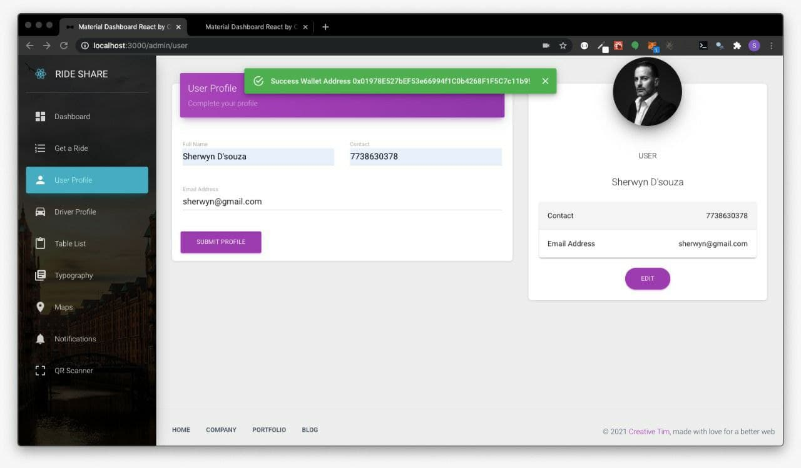
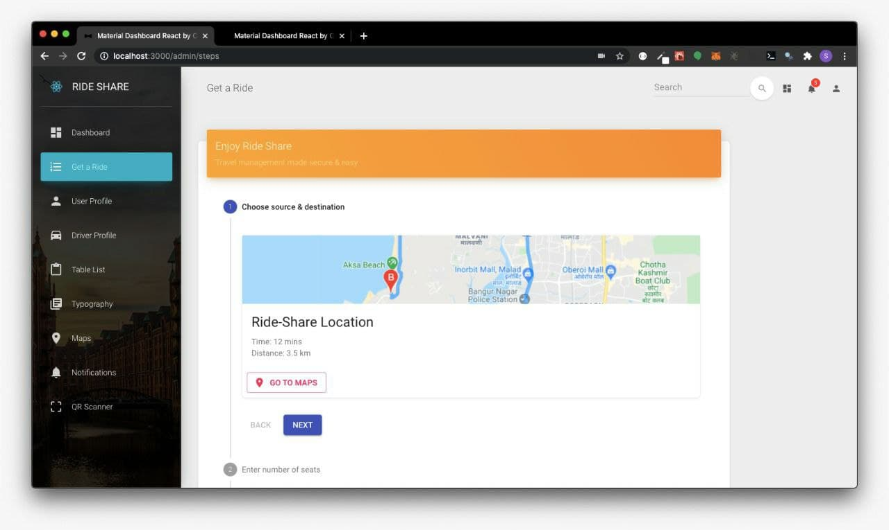
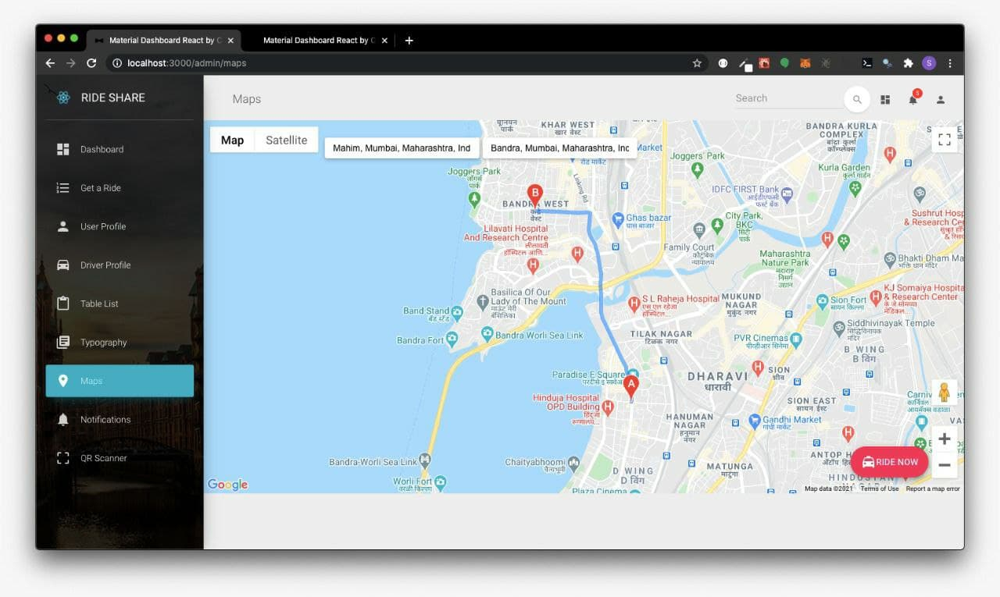
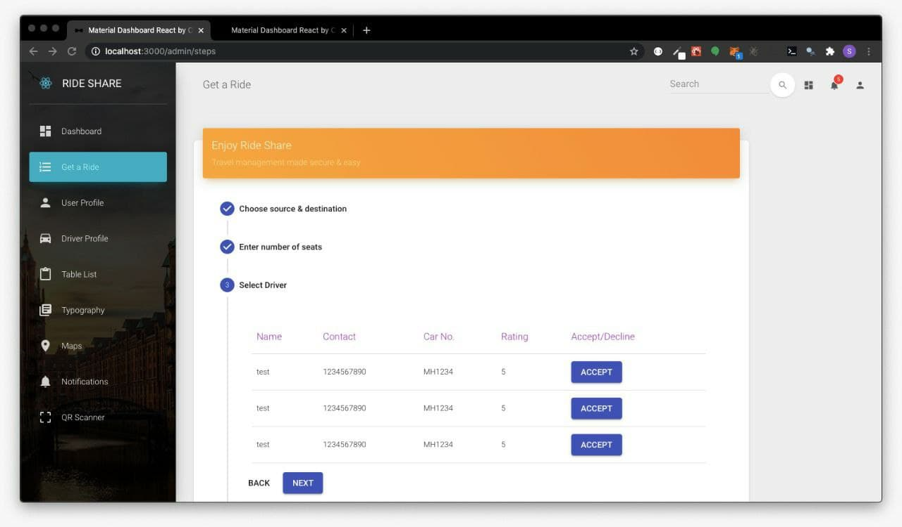
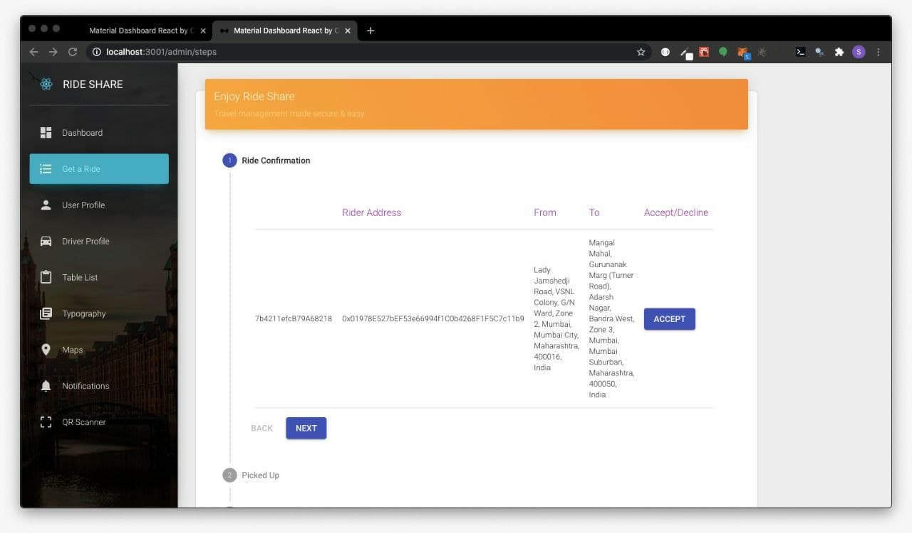
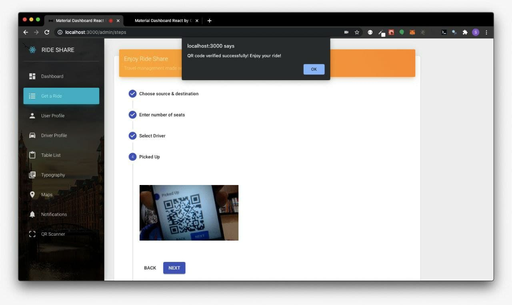
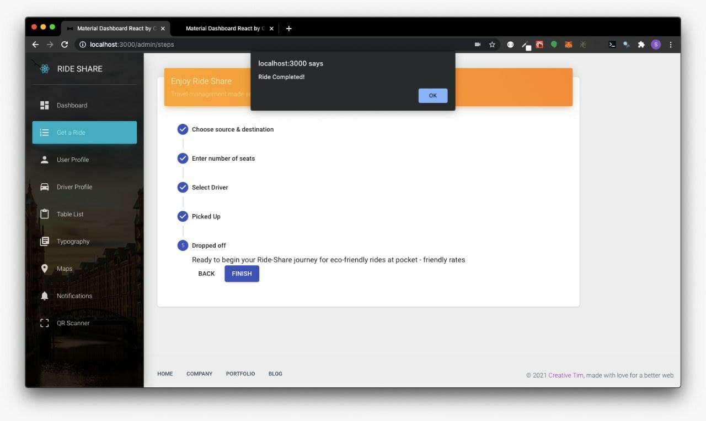

# KEDS-Rideshare-KUHacks-Frontend 


## The problem RideShare solves


<p>The current ridesharing systems like Uber and Ola have many loopholes due to the centralized approach to manage business operations. These are huge markets that are only going to get bigger with time, as more users become comfortable with the idea of getting cabs to their location with the help of their mobile phones. However, these centralized system faces problems like</p>

<ul>
  <li>High fees due to intermediaries.</li>
  <li>Lack of transparency.</li>
  <li>Lack of safety standards.</li>
</ul>  
  
By using blockchain, we aim to improve the current cab service platforms. The benefits include

<ul>
  <li>Cost reduction.</li>
  <li>Transparency in the pricing.</li>
  <li>Safety and security standards.</li>
  <li>Environmentally cleaner.</li>
  <li>Economic opportunity.</li>
</ul>

## Challenges we ran into
<ul>
  <li>Integrating Google Maps API into our application due to the clashing versions.</li>
  <li>Blockchain is a relatively new topic so, it took time and effort to understand fundamental concepts and how to use it in our problem statement.</li>
  <li>There were so many components and processes going on that we had to really focus on to make sure it all worked together.</li>
  <li>Due to time contraints we were unable to implement Portis.</li>
</ul>

## Step Wise Breakdown
















## Getting Started

1. Install Dependecies
```bash
npm i
```

2. Start Server(For Development)
```bash
npm start
```

View the Backend repository <a href="https://github.com/sherwyn11/KEDS-Rideshare-KUHacks-Backend">here</a>.

## License

[](https://opensource.org/licenses/MIT)

[MIT License Link](https://github.com/sherwyn11/KEDS-Rideshare-KUHacks-Backend/blob/master/LICENSE)
